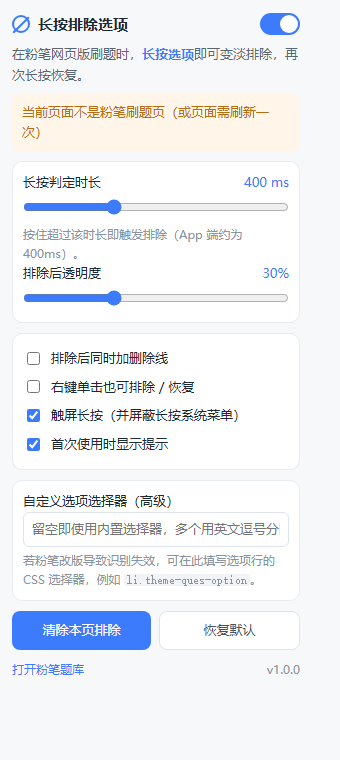

# 粉笔网页版「长按排除选项」Edge 扩展

让粉笔**网页版**拥有 App 端的长按排除体验：刷题时长按选项 → 该选项变淡排除；再次长按恢复。

- 📦 扩展本体（加载这个目录即可）：[fenbi-option-eliminator](fenbi-option-eliminator)
- 📖 安装与使用说明：[fenbi-option-eliminator/README.md](fenbi-option-eliminator/README.md)
- 🗜️ 打包产物：`fenbi-option-eliminator-v1.1.0.zip`
- 🖼️ 设置面板预览：[docs/popup-preview.png](docs/popup-preview.png)
- 🩺 独立诊断脚本（不依赖扩展，F12 控制台直接粘贴）：[diagnose/console-diagnose.js](diagnose/console-diagnose.js)



## 安装（摘要）

1. Edge 打开 `edge://extensions/` → 打开**开发人员模式**
2. **加载解压缩的扩展** → 选择 `D:\code\temp\fenbi\fenbi-option-eliminator`
3. 刷新已打开的粉笔页面，长按任意选项即可

## 实现要点

| 关注点 | 做法 |
| --- | --- |
| 选项识别（两套前端） | 新版 `spa.fenbi.com/ti/exam`：`li.choice-radio` / `li.choice-checkbox`（单选/多选/判断三组件）；老版 `www.fenbi.com/spa/tiku`：`li.theme-ques-option`；共 10 个内置选择器 |
| 结构兜底 | class 全变也能识别：行级元素内含恰好 1 个 `radio`/`checkbox`、文本 < 400 字、且是 `label` 或有 ≥2 个同标签兄弟 → 视为选项行（严格约束，不会误伤整题容器） |
| 长按判定 | `pointerdown` 起计时（默认 400ms），移动 >10px、滚动、抬起、失焦均取消，避免误触发 |
| 不误选答案 | 长按触发后，在 document 捕获阶段吞掉浏览器补发的 `click`（`preventDefault` + `stopImmediatePropagation`）；新版 `label[for]→input` 的原生勾选默认行为也会被一并取消（E2E 实测 `checked=null`） |
| 变淡样式 | 注入 `content.css`，用 `!important` 覆盖 Angular 视图封装（`[_ngcontent-ngc-xxx]`）的高优先级规则；透明度可由设置面板调节 |
| 切换题目自动清除 | 记录排除时的"序号+选项文本"快照，DOM 变化时校验；Angular 复用节点渲染新题时快照不一致即自动恢复 |
| 兼容性 | `all_frames` 注入、`composedPath()` 解析（可穿透 Shadow DOM）、触屏长按屏蔽系统菜单、SPA 路由切换无需重新注入 |
| 自诊断 | 面板「复制诊断报告」一键导出：URL/域、每个选择器命中数、识别到的选项数、最近一次按下的元素祖先链、结构兜底样例 |
| 隐私 | 仅 `storage` 权限 + `fenbi.com` 站点权限，无网络请求，无数据上传 |

## 测试

三套自动化测试，覆盖两代真实 DOM + 未知 class 兜底（无需登录粉笔），当前全部通过：

```powershell
# 1) jsdom 行为测试（老版 / 新版 / 未知 class 三套 DOM，98 项断言）
node test/run.mjs

# 2) 端到端测试：真实 Edge 内核 + 真实加载扩展 + 两套真实 DOM（20 项断言）
node test/e2e/run-e2e.mjs
```

| 测试 | 结果 |
| --- | --- |
| jsdom 行为测试（3 套 DOM） | **98 通过 / 0 失败** |
| Edge 端到端（老版 + 新版） | **20 通过 / 0 失败** |

- `test/fixture.html`（老版）、`test/fixture-v2.html`（新版，复刻你页面里的真实 HTML）、`test/fixture-generic.html`（未知 class）。
- `test/run.mjs`：每套 DOM 各跑一遍：识别、长按排除、click 拦截、短按不受影响、切题自愈、右键模式、
  总开关、消息通信、诊断报告、非选项区域不干扰。
- `test/e2e/run-e2e.mjs`：把扩展复制一份（仅放宽匹配到 `127.0.0.1`）后用
  `msedge --headless=new --load-extension` 打开本地 fixture；新版用例还断言"长按不会勾选该单选项、短按能正常勾选"。

> 测试目录需先安装依赖：`cd test && pnpm add jsdom`（本仓库已安装）。

## 已知边界

- 选择器与结构取自粉笔线上 bundle（新版 `chunk-EYRW5JFG.js` 的 `app-choice-radio/checkbox/true-false`）
  以及实测页面 HTML；未在登录态下做人工点击验证（无账号）。
- 若粉笔再次改版：先用面板「复制诊断报告」或 `diagnose/console-diagnose.js` 抓真实结构，
  再往内置选择器里加一条即可（或直接在设置里填自定义选择器，无需改代码）。
- 长按判定使用鼠标左键按住；触屏设备走 `pointerType === 'touch'` 分支。
